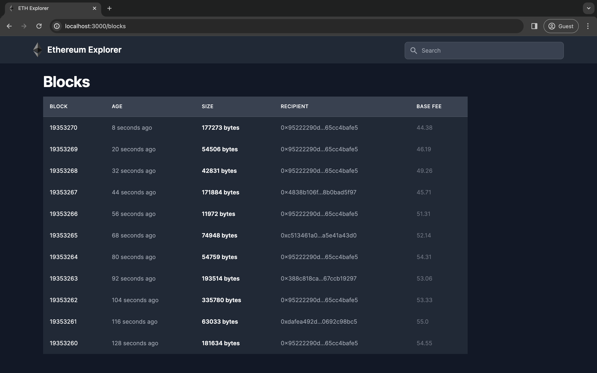
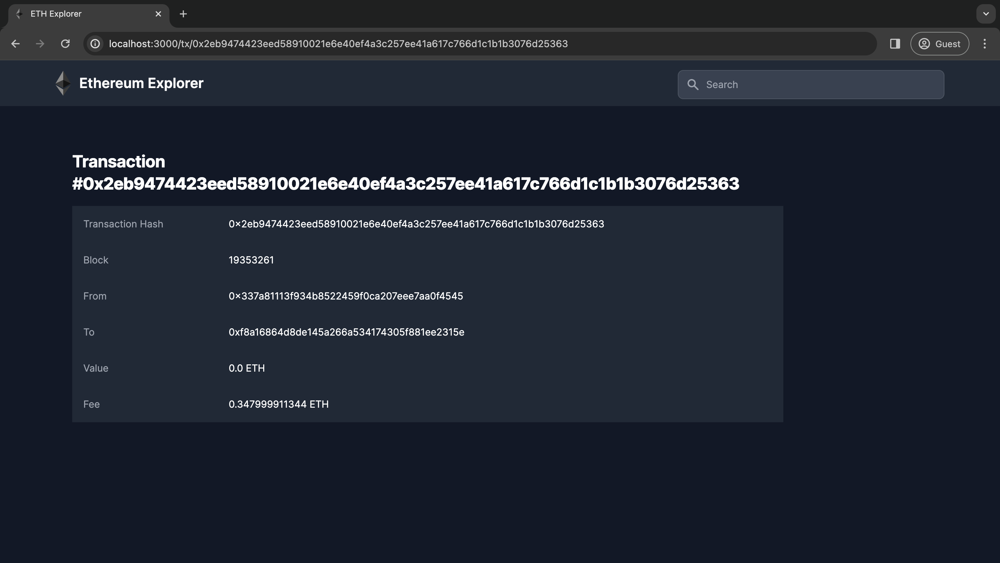

<p align="center">
  <a href="https://lpthong90.dev/rails-ethereum-tx-explorer/">
    
  </a>
  
  <br>
  <em>Using Ruby on Rails to demo a simple version of <a href="https://etherscan.io/" target="_blank">Etherscan</a>.</em>
</p>
<!--more-->

---

**Documentation**: <a href="https://lpthong90.dev/rails-ethereum-tx-explorer" target="_blank">https://lpthong90.dev/rails-ethereum-tx-explorer</a>

**Source  Code**: <a href="https://github.com/lpthong90/rails-ethereum-tx-explorer" target="_blank">https://github.com/lpthong90/rails-ethereum-tx-explorer</a>

---

# Features
- List recent blocks, and recent transactions.
- View a block, a transaction, and a address.
- Search:
  - Block by number.
  - Transaction by hash.
  - Address by address.

# Related Services
- Redis => Use for caching and websockets
- [Alchemy](https://www.alchemy.com/) => Get `API_KEY` to query blocks, transactions, addresses.

# Environment Variables
```
CACHE_URL: redis://localhost:6379/1
REDIS_URL: redis://localhost:6379/1
ALCHEMY_URL: https://eth-mainnet.g.alchemy.com/v2/<API_KEY>
ALCHEMY_WEBSOCKET_URL: wss://eth-mainnet.g.alchemy.com/v2/<API_KEY>
```

# Run
``` bash
> bundle install
> ./bin/dev
```

# Screenshots

Home page:


View recent blocks:


View block by hash or number:


View recent transactions:


View transaction by hash:


View address by hash:


# Video demo:

<p align="center">
    <iframe width="800" height="450" src="https://www.youtube.com/embed/si-zVREI_jw?si=9hBeEZqzt74KSXV9" title="YouTube video player" frameborder="0" allow="accelerometer; autoplay; clipboard-write; encrypted-media; gyroscope; picture-in-picture; web-share" allowfullscreen></iframe>
</p>
